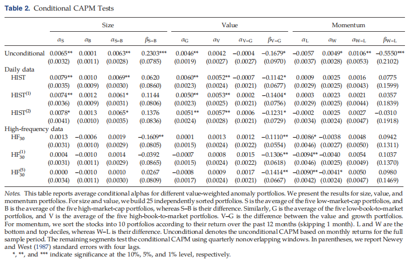

# The Conditional Captital Asset Pricing Model Revisited: Evidence from High-Frequency Betas

MANAGEMENT SCIENCE 2020 Fabian Hollstein et. al.

苏锦华
2022.04

---

## Content

- Introduction
- Data and Methodology
  - Historical Beta, Realized Beta, Hybric Beta
- The Conditional CAPM Revisited
  - Size, Value, Monmentum
  - Alternative Windows Lengths, Frequencies, Conditioning 
- The Precision of High-Frequency Betas
  - RMSE, Regression
- Conclusion

---

## Introduction

> 本文重新研究了条件CAPM的在高频数据下的表现。在一个2500多只股票的大样本，包括1996年至2014年期间的每日和高频数据，以实证检验条件资本资产定价模型是否能够解释资产价格异常。

Conditional CAPM能否解释超额收益

conditional CAPM(day): small, **big**, growth, value, **loser**, and **winner**

*value* (value minus growth) *momentum* (winners minus losers)
*size* (small minus big)

conditional CAPM(30m): **small**, **big**, **growth**, **value**, loser, and **winner**

---

## Data and Methodology

**Data**

- 时间：1996年1月至2014年12月的样本期美国股票
- 来源:
  - 证券价格研究中心（CRSP）的每日和每月价格和回报以及股息支付和流通股数据
  - Tick History（TRTH）数据库收集高频价格数据
- 范围:
  - 在纽约证券交易所（NYSE）、美国证券交易所（AMEX）和美国证券交易商协会自动报价系统（NASDAQ）上交易的所有股票

---

- 其他辅助数据
  - 利率期限结构的数据--IvyDB
  - 无风险（一个月期国库券）利率--Kenneth French
- 数据处理
  - 排除了非常缺乏流动性的股票
  - 交易时间过滤
  - 利用CRSP提供的股票分割和分配数据来补充TRTH数据，以调整TRTH隔夜收益率
  - 为了防止小型股票非交易的潜在影响（Gorodnichenko和Weber 2016）主要研究30分钟的频率

---

## Data and Methodology
**Historical Beta**

$$
\beta_{j, t}^{\mathrm{HIST}}=\frac{\operatorname{cov}\left(r_{j}-r_{f}, r_{M}-r_{f}\right)}{\operatorname{Var}\left(r_{M}-r_{f}\right)}
$$
<!-- where $\beta_{j, t}^{\mathrm{HIST}}$ denotes the estimator for the historical beta of asset $j$ using data from time $t-k$ to $t$. Here $k$ is the length of the estimation window, $r_{j}$ is the vector of returns on asset $j, r_{M}$ denotes the return vector of the market, and $r_{f}$ is the vector of the risk-free rate.  -->

$$
\begin{aligned}
r_{j, \tau}-r_{f, \tau}=& \alpha_{j, t}+\beta_{j, t}^{(0)}\left(r_{M, \tau}-r_{f, \tau}\right)+\beta_{j, t}^{(1)}\left(r_{M, \tau-1}-r_{f, \tau-1}\right) \\
&+\beta_{j, t}^{(2)}\left(\sum_{n=2}^{l} r_{M, \tau-n}-r_{f, \tau-n}\right)+\epsilon_{j, \tau}
\end{aligned}
$$

<!-- We incorporate $l=1$ up to $l=4$ lagged returns. In the case of $l=1$, the term associated with $\beta_{j, t}^{(2)}$ drops. The estimator for beta is then $\beta_{j, t}^{\mathrm{HIST}^{(i)}}=\sum_{i=0}^{\min (2, l)} \beta_{j, t}^{(i)}$, where $\min (\cdot)$ is the minimum operator. -->

---

## Data and Methodology

**Realized Beta**
<!-- Realized Beta. Following Andersen et al. (2006), we use realized beta $\left(\mathrm{HF}_{\text {freq }}\right)$. We use intraday highfrequency (log) returns, sampled at intervals of freq minutes to estimate ${ }^{3}$ -->
$$
\beta_{j, t}^{\mathrm{HF}}=\frac{\sum_{\tau=1}^{N} r_{j, \tau} r_{M, \tau}}{\sum_{\tau=1}^{N} r_{M, \tau}^{2}}
$$

**Hybird Beta**

<!-- 2.2.3. Hybrid (Option-Implied) Beta. We also consider the hybrid estimator of Buss and Vilkov (2012) (BV), which has been shown by Hollstein and Prokopczuk (2016) to yield the most accurate predictions among models relying on daily or monthly return data. Essentially, the approach combines model-free option-implied volatilities and historical correlations to estimate beta. Buss and Vilkov (2012) use (1) the identity that the implied variance of the market index has to be the same as the implied variance of the value-weighted portfolio of all index constituents and (2) a technical condition that maps physical correlations $\left(\rho_{j i, t}^{\mathbb{P}}\right)$ into risk-neutral correlations $\left(\rho_{j i, t}^{\mathbb{Q}}\right)$, namely $\rho_{j i, t}^{\mathbb{Q}}=\rho_{j i, t}^{\mathbb{P}}-$ $\alpha_{t}\left(1-\rho_{j i, t}^{\mathbb{P}}\right) .^{5}$ Combining these two relations and solving for $\alpha_{t}$, the authors recover implied correlations. Thus, a beta estimate under the risk-neutral probability measure is obtained by -->
$$
\beta_{j, t}^{\mathrm{BV}}=\frac{\sigma_{j, t, T}^{\mathbb{Q}} \sum_{i=1}^{N} \omega_{i, t} \sigma_{i, t, T}^{\mathbb{Q}} \rho_{j i, t}^{\mathbb{Q}}}{\left(\sigma_{M, t, T}^{\mathbb{Q}}\right)^{2}}
$$
<!-- where $\sigma_{j, t, T}^{\mathbb{Q}}$ and $\sigma_{M, t, T}^{\mathbb{Q}}$ denote the option-implied volatilities at time $t$ from options of asset $j$ and the market index, respectively. The implied volatilities needed for the approach are extracted from options whose time to expiration $T-t$ matches the evaluation horizon $m$. Thus, for our main tests, we use options with a time to maturity of 30 days. Then $\omega_{i, t}$ denotes the weight of asset $i$ in the market index at time $t$. We use all daily returns observed in the measurement period to obtain the correlations needed for the standard BV estimator. -->

---

## Data and Methodology
**Summary Statistics and Correlation Analysis**

---

- 所有历史和高频估计器的总观测数都要高得多，主要是因为混合估计器只能在每个时间点对标准普尔500指数
- 添加滞后Beta会显著增加HIST中的测量误差,估计器中的噪声自然会增加标准偏差，并在AR（1）系数中产生衰减偏差
- 由于HIST的加权平均值为1.00，几乎没有证据表明HIST存在系统性偏差,因此，我们主要讨论无滞后调整的估计量
- 相比之下，高频估计器的加权平均β值略低于1，对于某些股票而言，不频繁且不同步的交易可能会使贝塔系数偏向于零。加上一个滞后，加权平均值上升
- 观察到历史每日和30分钟高频估计器之间的相关性为0.78

---

## The Conditional CAPM Revisited
**Setup**
实证试图研究以下问题：高频贝塔估计值下条件CAPM表现如何？高频贝塔能帮助解释为什么小公司的股市收益通常优于大公司吗？如何解释高频Beta相对于低频Beta的优势？条件CAPM模型能否解释为什么过去的赢家股票通常表现优于过去的输家股票？
本文遵循Lewellen和Nagel（2006）提出的方法，直接估计条件β，同时获得条件α的估计。借此对整个样本进行划分(季度非重叠窗口)，容许条件β时序变化，用于无条件测试。对于每个异常投资组合的条件α和β。得到条件α的时间序列，我们可以通过测试平均α是否显著不同于零来直接测试条件CAPM。使用稳健的Newey和West（1987）标准误差和四个滞后来评估统计显著性。

---

对于所有异常投资组合，利用纽约证券交易所断点，对相应股票条件α和β进行加权平均得到投资组合的条件α和β。我们按照Lewellen和Nagel（2006）的观点构建了Size和Value投资组合。构造的出发点主要是账面市盈率相关数据，每个月将这些股票独立分类为25个大小的账面市值投资组合，并根据这些投资组合的组合进行测试：
- S(small)是五个低市值投资组合的平均值
- B(big)是五个高市值投资组合的平均值，而S–B是它们的差异
- G(groth)是五个低账面市值投资组合的平均值
- V(value)是五个高账面市值投资组合的平均值，V–G是价值和增长投资组合之间的差异

---

- momentum是根据之前12个月的回报率将股票分为10个投资组合，而跳过最近1个月（Jegadeesh和Titman 1993）
- L（loser）和W（winner）是底部和顶部的10%位，W–L是赢家和输家投资组合之间的差异

---

## The Conditional CAPM Revisited
**Unconditional & Conditional CAPM**

---

## The Conditional CAPM Revisited
**Underconditioning Bias**

<!-- Following Lewellen and Nagel (2006) and Boguth et al. (2011), we now examine the potential bias that could be introduced by underconditioning (i.e., by using the unconditional CAPM instead of the conditional CAPM when betas indeed vary over time). Boguth et al. (2011) show that if the conditional alphas are uncorrelated with the market excess return, the bias in unconditional alphas, that is, the difference between the unconditional alpha $\left(\alpha_{j}^{\text {unc }}\right)$ and the average conditional alpha $\left(\bar{\alpha}_{j}^{\text {cond }}\right)$, can be described as -->
$\alpha_{j}^{\text {unc }}-\bar{\alpha}_{j}^{\text {cond }}=\left(1+\frac{\bar{R}_{M}^{2}}{\sigma_{M}^{2}}\right) \operatorname{cov}\left(\beta_{j, t}, \mathbb{E}_{t}\left(R_{M, t}\right)\right)$
$\frac{-\left(\frac{\bar{R}_{M}}{\sigma_{M}^{2}}\right) \operatorname{cov}\left(\beta_{j, t}, \mathbb{E}_{t}\left(R_{M, t}^{2}\right)\right)}{\text { market-timing bias }}$
$\underbrace{-\left(\frac{\bar{R}_{M}}{\sigma_{M}^{2}}\right) \operatorname{cov}\left(\beta_{j, t}, \sigma_{M, t}^{2}\right)}_{\text {volatility-timing bias }}$,
<!-- where $R_{M, t}$ denotes the market excess return (i.e., $\left.r_{M, t}-r_{f, t}\right), \bar{R}_{M}$ is the average market excess return, $\sigma_{M}^{2}$ is the unconditional variance of the market excess return, and $\sigma_{M}^{2}$ is its conditional expectation. -->
---

继Lewellen和Nagel（2006年）和Boguth等人（2011年）之后，我们现在研究了欠条件(underconditioning)可能引入的潜在偏差（即当β确实随时间变化时，使用无条件CAPM而不是传统CAPM）。Boguth等人（2011年）表明，如果条件α与市场超额收益不相关，则无条件α中的偏差等于无条件α与平均条件α之间的差异。
欠条件偏差包括市场时间偏差和波动时间偏差。市场时机偏差源于条件β与预期市场超额收益或预期市场超额收益平方的协变量，反映了β可能随商业周期而变化的事实（Jagannathan和Wang，1996），“通常小于0.20%”的偏差，“最大为0.35%”。波动时间偏差源于条件β与市场条件波动的负协变量，这似乎对动量尤其明显，波动时间偏差达到每月0.10%到1.01%之间的值。对于本文样本中的投资组合，Alpha的绝对值在大盘对开本的每月0.01%和momentum反常投资组合的每月1.06%之间。
  - 因此，我们观察到的无条件回报的幅度可能与欠条件的偏差一致。

---

## The Conditional CAPM Revisited
**Alternative Windows Lengths, Frequencies, Conditioning**

---

使用三个月的窗口来估计条件α和β。然而，窗口长度涉及到一个权衡：一方面，较短的窗口可能会提高模型的性能，因为它允许在beta中有更大的变化；另一方面，更长的窗口可以提高条件alpha和beta估计的精度，并以这种方式改善模型性能。因此，在表3中检查了1个月、6个月和12个月的替代窗口长度。只报告主要估计器HIST、HF30和HF（1）30的结果。如表所示，**这些变化并不影响主要结论**。

---

## The Conditional CAPM Revisited
**Alternative Windows Lengths, Frequencies, Conditioning**

---

检查高频估计模型的替代采样频率对结果的影响。根据有无滞后的5分钟、75分钟和130分钟数据检验了参数估计。对于所有这些估计模型，我们获得了与HF30定性相似的结果：基于高频数据的条件CAPM可以解释Size、Value和Momentum异常。

---

## The Conditional CAPM Revisited
**Alternative Windows Lengths, Frequencies, Conditioning**

---

Boguth等人（2011年）警告说，可能会在分析中引入偏差，因为用于计算条件α的贝塔估计值在投资者进行投资之前是无法事先获得的。为了检查我们的结果是否受到这种偏见的影响，我们使用三种不同的替代方法重复前面的分析。首先，我们只是使用滞后的beta作为未来beta的代理。其次，我们估计下述回归方程。

$$
\beta_{j, t}=a_{j}+b_{j} \beta_{j, t-1}+\epsilon_{j, t}
$$

本文使用了这种方法的两种变体：一种是使用Boguth等人（2011）中的完整样本，另一种实时实现的，只使用时间t之前的数据，并使用36个月窗口初始化的扩展窗口。我们在表5中给出了这些方法的结果。结果与baseline非常相似。我们发现，基于高频数据的条件CAPM仍然可以解释所有三种情况下的大小、值和动量异常。

---

## The Precision of High-Frequency Betas

$$
\mathrm{RMSE}=\sqrt{\frac{1}{n} \sum_{t=1}^{n}\left(\beta_{t, T}^{\mathrm{R}}-\beta_{t}\right)^{2}},
$$
<!-- where $n$ is the number of out-of-sample observations, $\beta_{t, T}^{R}$ is the realized beta in the period ranging from $t$ to $T$, and $\beta_{t}$ denotes an estimate for beta. For HIST, we find that the lowest average RMSE is obtained for a 12 -month estimation window. For $\mathrm{HF}_{30}, \mathrm{BV}$, and $\mathrm{BV}_{30}$, a 6 -month estimation period turns out to be best. Thus, in the following we stick to these measurement periods for our estimators. -->
计算不同方法的样本外预测误差。每个月，我们都会根据过去12个月的估值，将这些股票分为五个投资组合。我们获得每个投资组合和方法的价值加权平均贝塔值，并使用随后一个月的30分钟回报率衡量每个投资组合的已实现贝塔值。第一行报告所有投资组合的平均RMSE。括号中数字的绝对值表示差异显著的投资组合份额为5%（例如，0.4表示差异显著的投资组合份额为40%）。用改进的Diebold–Mariano和Wilcoxon符号秩检验对上下三角矩阵进行显著性检验。括号中数字的符号表示显著差异的方向。

---
## The Precision of High-Frequency Betas

---
## The Precision of High-Frequency Betas

---
## The Precision of High-Frequency Betas

---
## The Precision of High-Frequency Betas

---
## The Precision of High-Frequency Betas

---
## The Precision of High-Frequency Betas

---
## The Precision of High-Frequency Betas

---
## The Precision of High-Frequency Betas

<!-- regressions. We regress the one-month (ex post) realized beta on the different predictions for beta: -->
$$
\beta_{t, T}^{\mathrm{R}}=a+b \beta_{t}+\epsilon_{T},
$$
<!-- where $\beta_{t}$ denotes one beta estimate in univariate regressions or a vector of several beta estimates in encompassing regressions, and $\beta_{t, T}^{R}$ is as previously defined. -->

---
## The Precision of High-Frequency Betas

<!-- should be close to 1 . Second, to capture the magnitude of cross-sectional predictability, we use Fama and MacBeth (1973) cross-sectional regressions of realized beta on the estimates of each approach. That is, each month, we fit the following cross-sectional regression model: -->
$$
\beta_{j, t, T}^{\mathrm{R}}=a_{T}+b_{T} \beta_{j, t}+\epsilon_{j, t, T},
$$
<!-- where $a_{T}$ and $b_{T}$ denote the time $T$ regression intercept and slope, respectively. All other variables are as previously defined. To estimate Equation (9), we follow the generalized method of moments instrumental variables (IV-GMM) estimator approach of Kim and Skoulakis (2016). A good model should have an intercept close to 0 , a slope coefficient close to 1 , and a high $R^{2}$. -->

---

## Conclusion

本文基于日数据和高频数据，用betas检验了条件CAPM。而对于日常数据，该模型无法解释规模异常和三个主要异常的六个组成部分中的三个，而条件CAPM可以解释规模、价值和动量异常，以及使用高频数据时六个组成部分投资组合中的五个。我们发现，高频贝塔的优越经济价值与未来实现贝塔的优越可预测性有关。从高频数据估计的贝塔值比从日收益数据估计的贝塔值要准确得多。我们发现，在Mincer–Zarnowitz回归中，从高频数据估计的Beta也优于基于每日数据的Beta，并且具有更好的横截面可预测性。